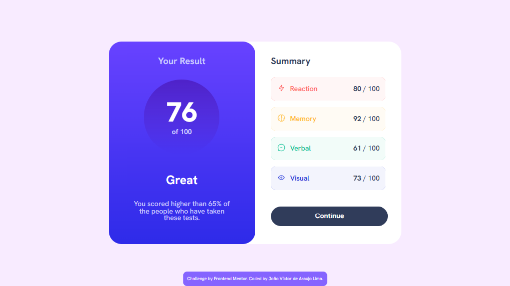
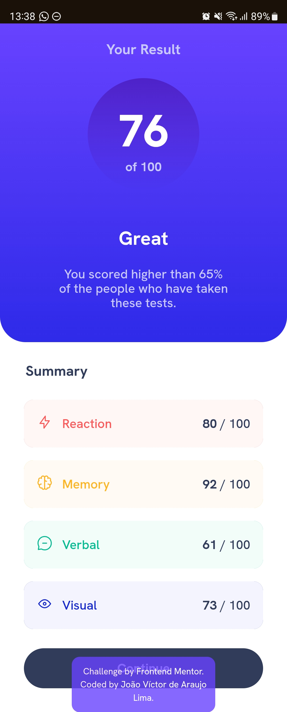

# Frontend Mentor - Results summary component solution

## Languages
This first section is in English. 

[Versão em português logo abaixo.](#portuguese)

## Context

This is a solution to the [Results summary component challenge on Frontend Mentor](https://www.frontendmentor.io/challenges/results-summary-component-CE_K6s0maV). Frontend Mentor challenges help you improve your coding skills by building realistic projects. 

> Your challenge is building out this results summary component and getting it as close to the design as possible.

## Table of contents

- [Overview](#overview)
  - [The challenge](#the-challenge)
  - [Screenshot](#screenshot)
  - [Links](#links)
- [My process](#my-process)
  - [Built with](#built-with)
  - [What I learned](#what-i-learned)
- [Author](#author)

## Overview

### The challenge

Users should be able to:

- View the optimal layout for the interface depending on their device's screen size
- See hover and focus states for all interactive elements on the page
- <s>**Bonus**: Use the local JSON data to dynamically populate the content</s>

### Screenshot

#### Desktop

<p align="center">
  
</p>

#### Mobile

<p align="center">
  
</p>

### Links

- Solution URL: [GitHub Repository](https://github.com/xuaun/results-summary-component)
- Live Site URL: [Live Page](https://your-live-site-url.com)

## My process

### Built with

- Semantic HTML5 markup
- CSS custom properties
- Flexbox
- CSS Grid
- Media Query + clamp()

### What I learned

In this project I was able to use flexbox, grid, variable, and media query concepts in CSS, as well as using a ready-made Figma design to create this component. I also used `rem` for measurements, `clamp()` to help with responsiveness, and BEM methodology for naming classes.

Something I learned in this project was to create a gradient color for the background.

```css
.results {
    background: linear-gradient(
    180deg,
    var(--blue-0-gradient-1) 0%,
    var(--blue-100-gradient-1) 100%
  );
}
```

## Author

- Website - [João Víctor de Araujo Lima's Portfolio](https://xuaun.github.io/)
- Frontend Mentor - [@xuaun](https://www.frontendmentor.io/profile/xuaun)


____
<br>

# <p id="portuguese">Frontend Mentor - Solução do projeto de componente de resumo de resultados</p>

## Contexto

Esta é uma solução para o [desafio de componente de resumo de resultados no Frontend Mentor](https://www.frontendmentor.io/challenges/qr-code-component-iux_sIO_H). Os desafios do Frontend Mentor ajudam você a melhorar suas habilidades de codificação construindo projetos realistas.

> Seu desafio é criar esse componente de resumo de resultados e deixá-lo o mais próximo possível do design.

## Lista de conteúdos

- [Visão Geral](#visão-geral)
  - [Desafio](#desafio)
  - [Prints](#prints)
  - [Links](#links-pt)
- [Meu processo](#meu-processo)
  - [Tecnologias utilizadas](#tecnologias-utilizadas)
  - [O que eu aprendi](#o-que-eu-aprendi)
- [Autor](#autor)

## Visão Geral

### Desafio

Os usuários devem ser capazes de:

- Visualizar o layout ideal dependendo do tamanho da tela do dispositivo
- Veja os estados de foco para elementos interativos
- <s>**Bônus**: Use os dados JSON locais para preencher dinamicamente o conteúdo</s>

### Prints

#### Computador

<p align="center">
  
</p>

#### Celular

<p align="center">
  
</p>

### <p id="links-pt">Links</p>

- Link da solução: [Repositório no GitHub](https://your-solution-url.com)
- Site com a solução: [Página no ar](https://your-live-site-url.com)

## Meu processo

### Tecnologias utilizadas

- HTML5
- CSS
- Flexbox
- CSS Grid
- Media Query + calmp()

### O que eu aprendi

Neste projeto eu pude utilizar conceitos de flexbox e grid, de variáveis e de media query no CSS, além de usar um design pronto do Figma para a elaboração deste componente. Eu também usei `rem` para medidas, `clamp()` para ajudar na responsividade e metodologia BEM para nomear classes.

Algo que aprendi neste projeto foi criar uma cor em degrade para o background.

```css
.results {
    background: linear-gradient(
    180deg,
    var(--blue-0-gradient-1) 0%,
    var(--blue-100-gradient-1) 100%
  );
}
```

## Autor

- Website - [Portfólio - João Víctor de Araujo Lima](https://xuaun.github.io/)
- Frontend Mentor - [@xuaun](https://www.frontendmentor.io/profile/xuaun)

